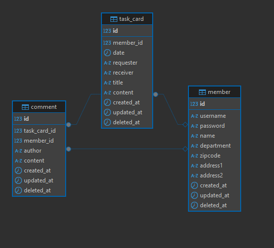

# 업무 요청용 캘린더 프로젝트 


---


## 1. 프로젝트 소개

날짜별로 업무카드를 등록 및 조회하고, 업무 카드별로 댓글을 통해 직원들끼리 소통할 수 있는 업무용 캘린더 프로젝트입니다.

---

## 2. 프로젝트 빌드 및 실행 방법

본 프로젝트는 **Backend(Spring Boot)** + **Frontend(React)** 로 구성되어 있습니다.  

```

backend/
frontend/

````

---

## 2-1. 공통 준비 사항

1. Java 17 설치  
2. Node.js 18 이상 설치
3. MySQL 8.3.0 설치
4. MySQL 환경에서 아래 쿼리문을 실행하여 DB 생성

```sql
CREATE DATABASE work_calendar CHARACTER SET utf8mb4 COLLATE utf8mb4_general_ci;
````

---

## 2-2. 백엔드 실행 방법 (Spring Boot)

백엔드 폴더: `backend/`

### ① DB 설정 수정 (`application.yml`)

아래 설정에서 MySQL 설치 시 설정한 root 비밀번호로 password 값을 수정해줍니다.

```yaml
spring:
  datasource:
    url: jdbc:mysql://localhost:3306/work_calendar?serverTimezone=Asia/Seoul&characterEncoding=UTF-8
    username: root
    password: {설정한 비밀번호}
  jpa:
    hibernate:
      ddl-auto: none
```

---

### ② DB 테이블 생성
아래 SQL 스크립트를 MySQL에 그대로 실행하면 member, task_card, comment 테이블이 생성됩니다.

```sql

-- 1) member
CREATE TABLE `member` (
                          `id` bigint NOT NULL AUTO_INCREMENT,
                          `username` varchar(50) NOT NULL,
                          `password` varchar(255) NOT NULL,
                          `name` varchar(50) NOT NULL,
                          `department` varchar(100) DEFAULT NULL,
                          `zipcode` varchar(10) DEFAULT NULL,
                          `address1` varchar(255) DEFAULT NULL,
                          `address2` varchar(255) DEFAULT NULL,
                          `created_at` datetime NOT NULL DEFAULT CURRENT_TIMESTAMP,
                          `updated_at` datetime NOT NULL DEFAULT CURRENT_TIMESTAMP ON UPDATE CURRENT_TIMESTAMP,
                          `deleted_at` datetime DEFAULT NULL,
                          PRIMARY KEY (`id`),
                          UNIQUE KEY `username` (`username`)
) ENGINE=InnoDB AUTO_INCREMENT=11 DEFAULT CHARSET=utf8mb4 COLLATE=utf8mb4_0900_ai_ci;


-- 2) task_card
CREATE TABLE `task_card` (
                             `id` bigint NOT NULL AUTO_INCREMENT,
                             `member_id` bigint DEFAULT NULL,
                             `date` date NOT NULL,
                             `requester` varchar(255) COLLATE utf8mb4_general_ci NOT NULL,
                             `receiver` varchar(255) COLLATE utf8mb4_general_ci NOT NULL,
                             `title` varchar(255) COLLATE utf8mb4_general_ci NOT NULL,
                             `content` text COLLATE utf8mb4_general_ci NOT NULL,
                             `created_at` datetime DEFAULT CURRENT_TIMESTAMP,
                             `updated_at` datetime DEFAULT CURRENT_TIMESTAMP ON UPDATE CURRENT_TIMESTAMP,
                             `deleted_at` datetime DEFAULT NULL,
                             PRIMARY KEY (`id`),
                             KEY `fk_taskcard_member` (`member_id`),
                             CONSTRAINT `fk_taskcard_member` FOREIGN KEY (`member_id`) REFERENCES `member` (`id`) ON DELETE RESTRICT
) ENGINE=InnoDB AUTO_INCREMENT=28 DEFAULT CHARSET=utf8mb4 COLLATE=utf8mb4_general_ci;


-- 3) comment
CREATE TABLE `comment` (
                           `id` bigint NOT NULL AUTO_INCREMENT,
                           `task_card_id` bigint NOT NULL,
                           `member_id` bigint DEFAULT NULL,
                           `author` varchar(255) COLLATE utf8mb4_general_ci NOT NULL,
                           `content` text COLLATE utf8mb4_general_ci NOT NULL,
                           `created_at` datetime DEFAULT CURRENT_TIMESTAMP,
                           `updated_at` datetime DEFAULT CURRENT_TIMESTAMP ON UPDATE CURRENT_TIMESTAMP,
                           `deleted_at` datetime DEFAULT NULL,
                           PRIMARY KEY (`id`),
                           KEY `fk_comment_task_card` (`task_card_id`),
                           KEY `fk_comment_member` (`member_id`),
                           CONSTRAINT `fk_comment_member` FOREIGN KEY (`member_id`) REFERENCES `member` (`id`) ON DELETE RESTRICT,
                           CONSTRAINT `fk_comment_task_card` FOREIGN KEY (`task_card_id`) REFERENCES `task_card` (`id`) ON DELETE RESTRICT
) ENGINE=InnoDB AUTO_INCREMENT=25 DEFAULT CHARSET=utf8mb4 COLLATE=utf8mb4_general_ci;
```

---

### ③ 백엔드 실행

```bash
cd backend
./gradlew bootRun
```

실행 URL → [http://localhost:8080](http://localhost:8080)

---

## 2-3. 프론트엔드 실행 방법 (React)

프론트엔드 폴더: `frontend/`

### ① 패키지 설치

```bash
cd frontend
npm install
```

### ② 실행

```bash
npm run dev
```

접속 URL → [http://localhost:5173](http://localhost:5173)

---

## 3. 사용한 기술 스택

### 🔹 백엔드

* Java 17
* Spring Boot 3.5.8
* MySQL 8.3.0
* Spring Data JPA
* QueryDSL
* Gradle

### 🔹 프론트엔드

* React 
* Vite  
* Node.js
---

## 4. 주요 기능 설명

### 4-1. 로그인 / 회원가입

* 사용자 인증
* 회원가입 시 주소 입력 (카카오 주소 검색 서비스 활용)

### 4-2. 월간 캘린더 UI

* react-calendar 기반 UI
* 날짜별 업무카드 생성 버튼
* 날짜별 업무카드가 4개 이상이 될 시 스크롤 기능 활성화

### 4-3.업무카드 기능

* 본인이 등록한 업무카드만 수정/삭제 가능
* 상세 페이지 제공

### 4-4. 댓글 기능

* 본인이 등록한 댓글만 삭제 가능
* 업무카드별 댓글이 6개 이상이 될 시 페이징 처리


---

## 5. ERD
* member - 사용자 계정 정보를 저장하는 테이블
* task_card - 업무카드에 대한 정보를 저장하는 테이블
* comment - 업무카드에 달리는 댓글 정보를 저장하는 테이블




---

## 6. 시연 영상 링크

https://www.youtube.com/watch?v=yIdSBJYqI_E

---


